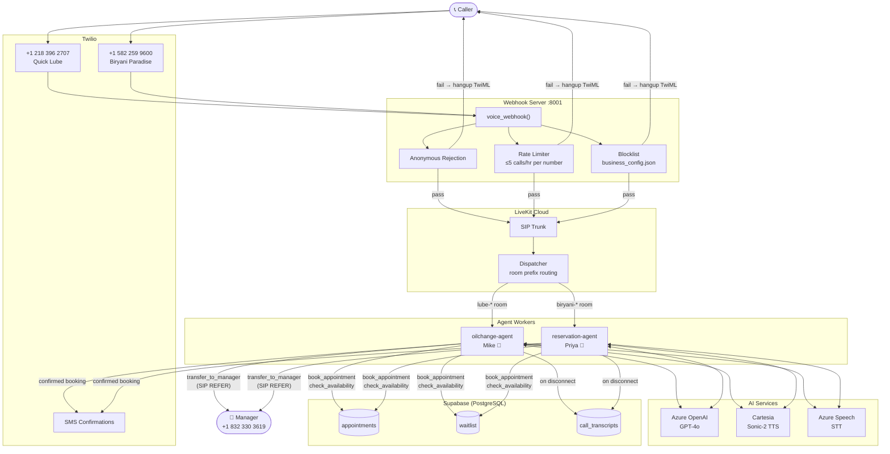
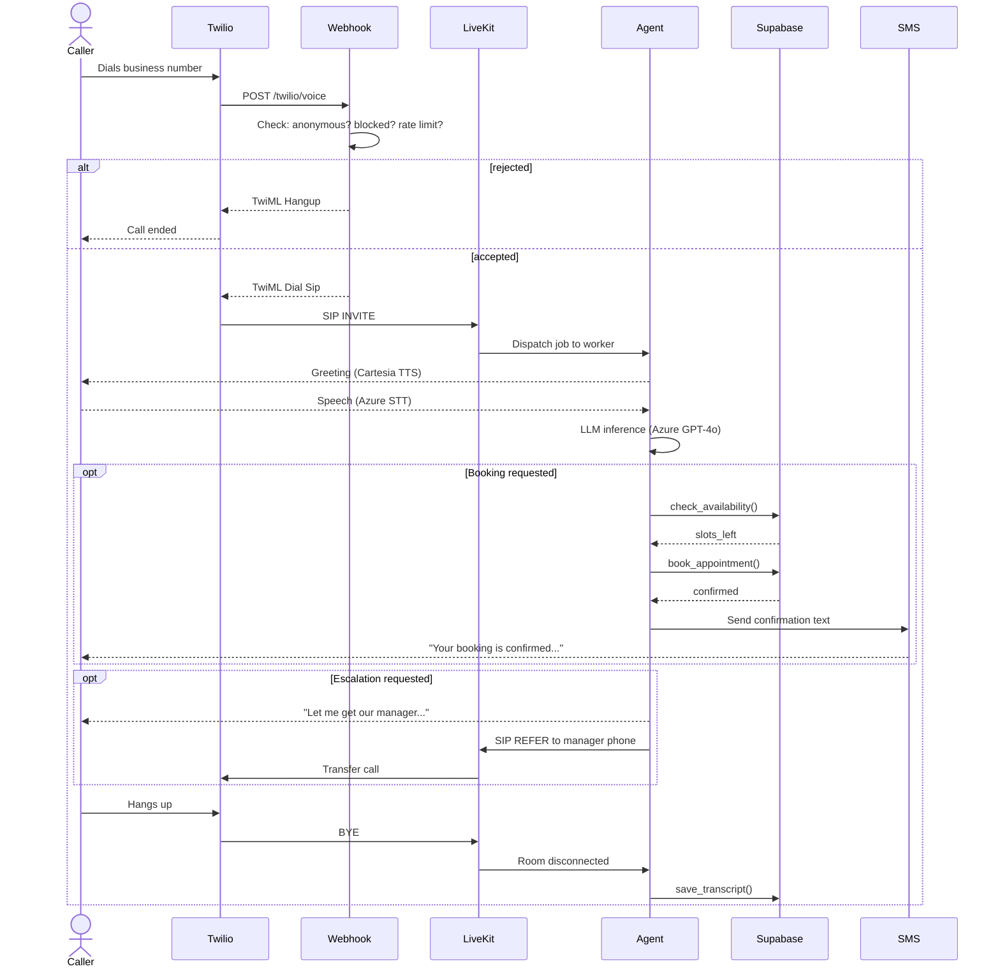

# Voice Agent Platform — Architecture

Multi-tenant AI voice agent platform built on LiveKit, Twilio, and Azure. Each business gets its own phone number, persona, and booking database. All operational settings (hours, manager number, rate limits) are driven by `business_config.json` — no code changes required.

---

## System Overview



---

## Call Flow



---

## Component Map

| Component | Technology | Purpose |
|---|---|---|
| Phone numbers | Twilio | Public PSTN entry points |
| Webhook server | Starlette + uvicorn :8001 | Twilio routing, spam protection |
| Voice infrastructure | LiveKit Cloud | SIP, real-time audio, dispatch |
| LLM | Azure OpenAI GPT-4o | Conversation, tool calling |
| TTS | Cartesia Sonic-2 | Natural-sounding speech output |
| STT | Azure Speech | Transcription of caller audio |
| VAD | Silero | Voice activity detection |
| Database | Supabase (PostgreSQL) | Bookings, waitlist, transcripts |
| SMS | Twilio Messaging | Booking confirmations |
| Config | `business_config.json` | Runtime settings, no deploy needed |

---

## Security Layers

```
Caller → [Anonymous check] → [Blocklist] → [Rate limit 5/hr] → Agent
                ↓                  ↓               ↓
            Hangup             Hangup           Hangup
```

- **Anonymous rejection** — calls with no caller ID are refused
- **Blocklist** — add a number to `business_config.json → security.blocked_numbers`, restart webhook
- **Rate limiting** — in-memory, per-number, per-hour (configurable)
- **Max call duration** — hard cap via TwiML `callTimeout` (default 10 min)

---

## Configuration — `business_config.json`

Operational settings that can be changed **without touching code** — edit the file, restart workers:

```jsonc
{
  "manager_phone": "+18323303619",      // escalation target

  "security": {
    "reject_anonymous_calls": true,
    "max_call_duration_seconds": 600,   // 10 min hard cap
    "rate_limit_calls_per_hour": 5,
    "blocked_numbers": []               // add spammers here
  },

  "quick_lube": {
    "name": "Golden Wrench Auto services",
    "phone": "+12183962707",
    "timezone": "America/New_York",
    "open_days": [0,1,2,3,4,5],        // Mon-Sat
    "open_hour": 8,
    "close_hour": 18
  },

  "biryani_paradise": {
    "name": "Biryani Paradise",
    "phone": "+15822599600",
    "timezone": "America/New_York",
    "open_hour": 11,
    "close_hour": 22
  }
}
```

---

## Repository Structure

```
my_autonomous_agent/
├── business_config.json          # Operational config (edit without code changes)
├── menu.json                     # Biryani Paradise menu
├── ARCHITECTURE.md               # This file
│
└── src/my_autonomous_agent/
    ├── oilchange_agent.py        # Mike — Golden Wrench Auto
    ├── reservation_agent.py      # Priya — Biryani Paradise
    ├── webhook.py                # Twilio routing + spam protection
    ├── api.py                    # CrewAI task UI (:8000)
    ├── config.py                 # business_config.json loader
    │
    ├── booking/
    │   ├── reservations.py       # Shared booking logic (all business types)
    │   └── supabase_client.py    # DB client
    │
    └── utils/
        └── sms.py                # Twilio SMS confirmations
```
