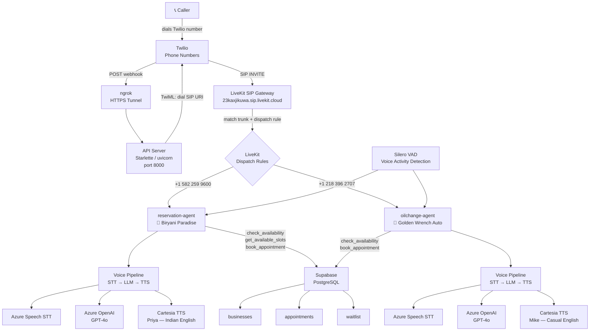

# Voice Agents Platform — Architecture

A multi-tenant AI voice agent platform where businesses receive phone calls handled by intelligent voice agents. Each agent books appointments, answers questions, and manages waitlists — all backed by a shared Supabase database.

## System Architecture



## Call Flow

```
1. Customer dials Twilio number
2. Twilio hits webhook → API server returns TwiML with SIP URI
3. Twilio bridges call into LiveKit SIP Gateway
4. LiveKit matches inbound number to dispatch rule → assigns agent
5. Agent joins room: STT transcribes speech → GPT-4o generates response → Cartesia speaks
6. Agent calls tools (check availability, book appointment) against Supabase
7. Booking confirmed — customer receives verbal confirmation
```

## Businesses

| Business | Phone | Agent | Persona | Capacity |
|---|---|---|---|---|
| Biryani Paradise | +1 582 259 9600 | reservation-agent | Priya | 10 tables, 50 seats |
| Golden Wrench Auto | +1 218 396 2707 | oilchange-agent | Mike | 3 bays |
| City Clinic | TBD | clinic-agent | Sarah | 1 slot / 30 min |

## Tech Stack

| Layer | Technology |
|---|---|
| Phone / PSTN | Twilio |
| SIP / WebRTC | LiveKit Cloud |
| Voice Activity Detection | Silero VAD |
| Speech-to-Text | Azure Speech Services |
| Language Model | Azure OpenAI GPT-4o |
| Text-to-Speech | Cartesia Sonic-2 |
| Database | Supabase (PostgreSQL) |
| Webhook Server | Starlette + uvicorn |
| Tunnel (dev) | ngrok |

## Project Structure

```
my_autonomous_agent/
├── src/my_autonomous_agent/
│   ├── reservation_agent.py      # Biryani Paradise — Priya
│   ├── oilchange_agent.py        # Golden Wrench Auto — Mike
│   ├── api.py                    # Twilio webhook + web UI
│   ├── booking/
│   │   ├── reservations.py       # Shared booking logic
│   │   └── supabase_client.py    # Supabase singleton
│   └── config/
│       ├── biryani_paradise.json
│       ├── quick_lube.json
│       └── city_clinic.json
├── menu.json                     # Biryani Paradise menu
├── schema.sql                    # Supabase schema + seed data
└── .env                          # API keys and credentials
```
